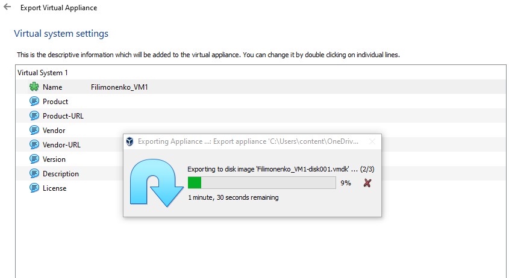
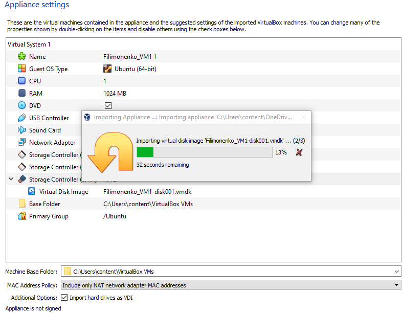
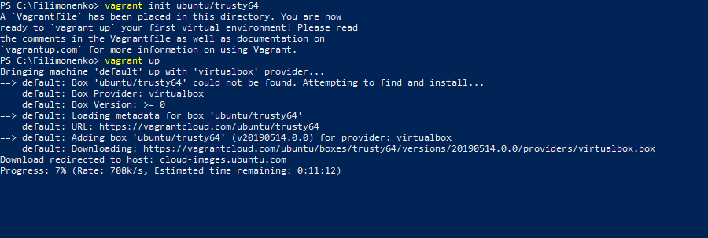
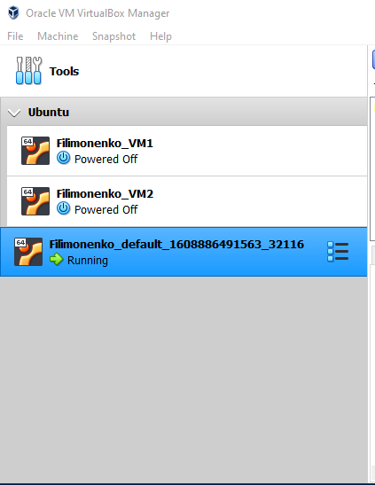
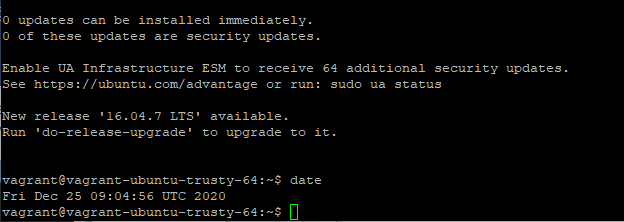
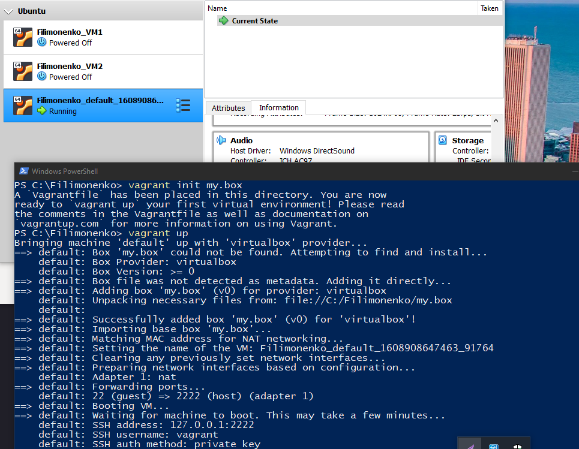

# Module 2 
## Virtualization and Cloud Basic
### Task 2.1 VirtualBox & Vagrant

#### PART 1. HYPERVISORS

1. The most popular hypervisors for infrastructure virtualization are:
- Xen;
- Linux KVM;
- Microsoft Hyper V;
- Oracle VirtualBox;
- VMware.

2. There are two main hypervisor types: "bare metal" (Microsoft Hyper-V) and "hosted" (VirtualBox). The main difference between them is that "bare metal" runs directly on the host's hardware while "hosted" type runs as a software layer on an operating system.

#### PART 2. WORK WITH VIRTUALBOX

In this part of the task I created a virtual machine in VirtualBox, installed Ubuntu in it, got acquainted with the possibilities of VM control, cloned my machine, created a group of two machines (VM1, VM2). 
In the task 1.7 I formed a branched tree of snapshots

Then export and import VM via *.ova* file

Created shared folder

Configured different VM's network modes, few examples below
Choose bridged adapters on both machines

NAT

#### PART 3. WORK WITH VAGRANT

During this part I downloaded and installed Vagrant. Initialized Vagrant base box ubuntu/trusty64 and made vagrant up

Then connected to the VM via SSH using Putty

After that I packed my own Vagrant box 

*Vagrant file is in the folder /m2/task2.1*

