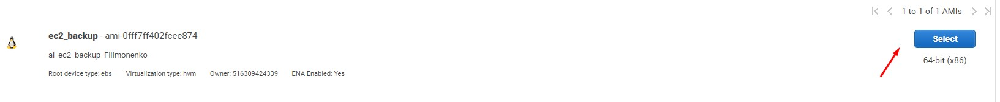
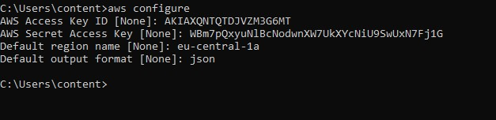
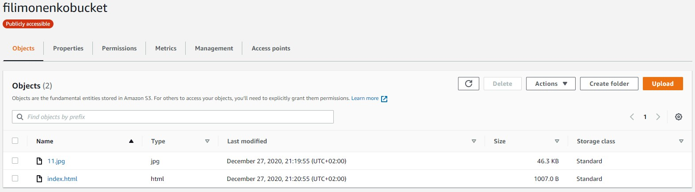

# Module 2 
## Virtualization and Cloud Basic
### Task 2.2 AWS Core Services

<a href="http://filimonenkobucket.s3-website.eu-central-1.amazonaws.com/">My static website</a>
 
In the course of doing this labwork I had to sign up for a AWS account, get acquainted with AWS Free Tier limits and work with some AWS services.

The first step was to launch instance via Amazon Lightsail

Next step was to launch another Linux Virtual Machine without Amazon Lightsail. Made it via EC2 and connected to instance via SSH 

Created a snapshot of my EC2 

Then I created and attached EBS to my 1st instance

After that I launched my instance from backup, detached EBS of the previous instance and attached to it 

Created S3 bucket, also get acquainted with batch upload via CLI 

Added IAM permission

The last task was to create a static website on Amazon S3

http://filimonenkobucket.s3-website.eu-central-1.amazonaws.com

