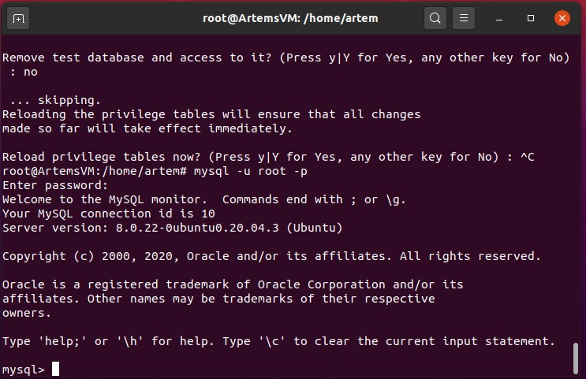
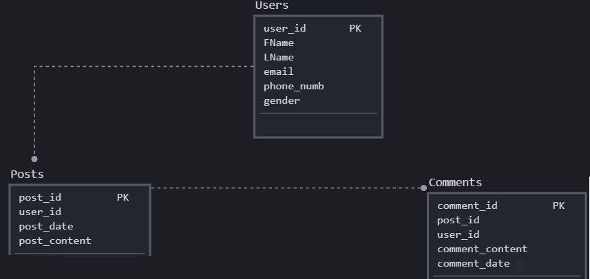
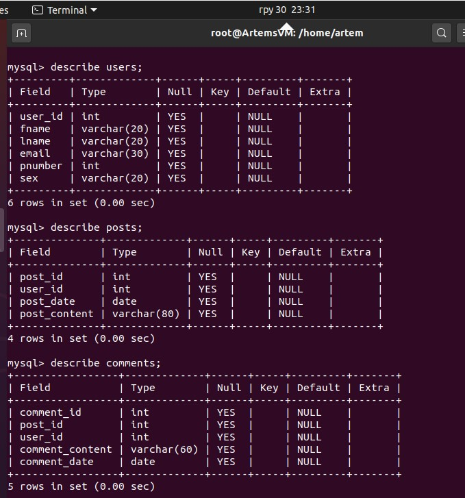
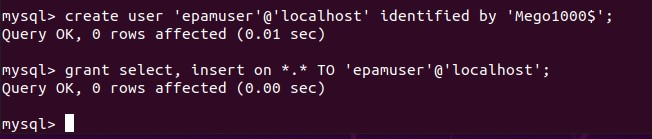
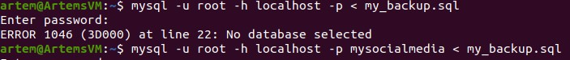
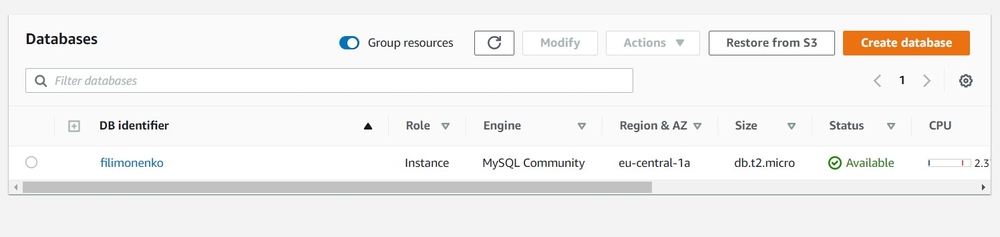
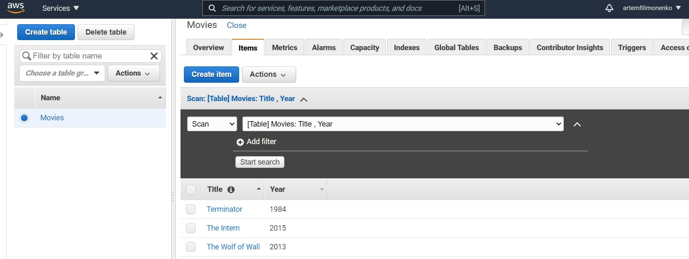

# Module 3 
## Database Administration
### Task 3.1

The main purposes of the labwork were:
- Create a database and fill in tables;
- Execute different queries;
- Practice with user privileges;
- Backup and restore database;
- Transfer DB to RDS AWS;
- Work with Dynamo DB.

Installing MySQL server on Virtual Machine

As a subject area I choose social media and describe the DB scheme of it
 

Created DB, tables in it and filled them 

Executed some of DB queries

Added a new user, grant him privilegies, connected to DB as a new user and checked if priovilegies work

Made a selection from the main table DB MySQL

Made a backup, chenged tables and then restore DB

Transfered my local DB to RDS AWS

Conected to my database on AWS RDS 

Created a dump of my database

Worked with DynamoDB, made a table, added some items and executed a query

